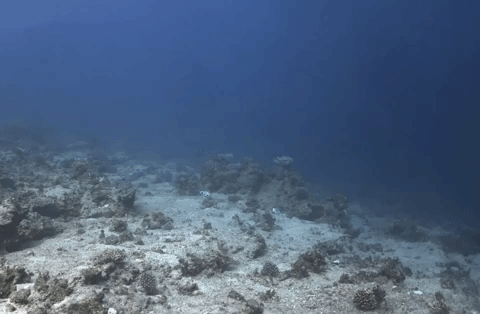
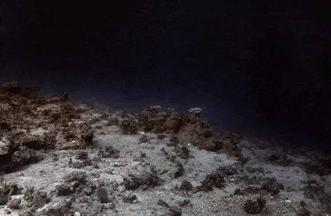

# SeaThru-NeRF for nerfstudio
<p align="center">


</p>

**Contributors**

- [Paul Setinek](https://www.linkedin.com/in/paul-setinek/) *(Main Author)*
- [Lukas Mosser](https://www.linkedin.com/in/lukas-mosser/) *(Supervisor, Aker BP)*
- [Lluis Guasch](https://www.imperial.ac.uk/people/l.guasch08) *(Supervisor, Imperial College London)*
- [Edmary Altamiranda Maldonado](https://www.linkedin.com/in/edmary-altamiranda-a53b629/) *(Aker BP)*
- [Jarle Marius Solland](https://www.linkedin.com/in/jarle-marius-solland-64244474/) *(Aker BP)*

**Affiliations**

This work was performed as part of a Master's Thesis at [Imperial College London](https://www.imperial.ac.uk/) in collaboration with [Aker BP ASA](https://www.akerbp.com/).

**Project description**

This repository provides a Neural Radiance Field (NeRF) approach specifically tailored to subsea scenes. Below you can see results of a conventional NeRF approach (nerfacto) compared to this implementation on a subsea scene:

<p align="center">

</p>

(The renders above are heavily compressed and show a lot of quality loss! The dataset of the shown scenes is not mine and available [here](https://sea-thru-nerf.github.io/).)

This repository is an unofficial extension of [Seathru-Nerf](https://sea-thru-nerf.github.io). It adapts and extends the approach introduced in the original [publication](https://arxiv.org/abs/2304.07743). The exact modifications and extensions are described [here.](#differences-to-official-implementation)

This implementation is built on top of [nerfstudio](https://docs.nerf.studio/en/latest/) and therefore allows for easy modification and experimentation.

A detailed description of the approach and general usage of this repository is provided in the documentation available [here](https://akerbp.github.io/seathru_nerf/). (For best functionality, please open the docs in Google Chrome) To use this repository, please refer to the [Requirements](#requirements) and [Installation](#installation) section and look at the simple usage example provided [here](#usage-example).

## **Table of Contents**

<!-- TOC -->
* [Differences to Official Implementation](#differences-to-official-implementation)
* [Requirements](#requirements)
* [Installation](#installation)
* [Usage Example](#usage-example)
* [Contributers and Credits](#contributers-and-credits)
* [License](#license)
<!-- TOC -->

## Differences to Official Implementation
The main difference compared to the [official implementation](https://github.com/deborahLevy130/seathru_NeRF) is that while the official implementation is based on [Mip-NeRF 360](https://github.com/google-research/multinerf), this repository is not. It instead uses buidling blocks of the nerfstudio library from various recent advancements in the domain like [instant-ngp](https://nvlabs.github.io/instant-ngp/) and others. Those modifications allowed for the following results:

- This approach works on 360-degree unbounded susbea scenes.
- A reduction of 65% of training time compared to the reportings released in the [publication](https://arxiv.org/abs/2304.07743). (Even 90% reduction if the lite model is used.)
- By offering a lite model that needs less memory, this implementation can be run on consumer GPUs.

## Requirements

This implementation requires a GPU with a CUDA copatible driver. There are two model configurations as summarised in the following table:

| Method              | Description   | Memory | Quality |
| ------------------- | ------------- | ------ | ------- |
| `seathru-nerf`      | Larger model  | ~23 GB | Best    |
| `seathru-nerf-lite` | Smaller model | ~7 GB  | Good    |

While the `seathru-nerf` method was primarily used for development and testing, the `seathru-nerf-lite` method still produces impressive and sharp results. If you happen to run into a `CUDA_OUT_MEMORY_ERROR` it is a sign that the available VRAM on the GPU is not enough. You can either use the smaller model, decrease the batch size, do both or upgrade to a better GPU.

## Installation

This repository provides a custom method for the [nerfstudio library](https://docs.nerf.studio/en/latest/). For full functionality, please make sure to first install nerfstudio as described [here](https://docs.nerf.studio/en/latest/quickstart/installation.html).


Then, clone this repository and install it via:

```bash
git clone https://github.com/psetinek/seathru_nerf.git
cd seathru_nerf
pip install -e .
```

Then, install the command line completion via:

```bash
ns-install-cli
```

To check the installation, type:

```bash
ns-train seathru-nerf --help
```

If you see the help message with all the training options, you are good to go and ready to train your first susbea NeRF! 🚀🚀🚀

## Usage Example

This section goes through a basic usage example of this repository. For a general in depth documentation, please look [here](https://akerbp.github.io/seathru_nerf/).

### Training your first subsea NeRF
To train your first subsea NeRF, please download the dataset available [here](https://sea-thru-nerf.github.io/). After unpacking, you can train the subsea NeRF with the following command:

```bash
ns-train seathru-nerf-lite --vis viewer+wandb colmap --data <path_to_dataset> --images-path images_wb
```

(If you get an error with the colmap path, create a directory `colmap` in the dataset folder and move the `sparse` folder into it.)

You can then track the training process on [wandb](https://wandb.ai/site) or watch it live via the [nerfstudio viewer](https://docs.nerf.studio/en/latest/quickstart/viewer_quickstart.html).

When training is completed (takes around 1hr for the SeaThru-NeRF dataset scenes with a RTX3060 Laptop GPU), the trained model will be saved to an `./outputs/` folder.

### Rendering videos from a trained NeRF
If you want to render a video from the trained model, make sure to first locate the config.yml of the trained model as you need to pass the path to the rendering script. This file can be found in the output folder created when training the NeRF. Due to the underlying image formation model that allows us to seperate between the objects and the water within a scene, you can choose the kind of video you want to render. The following options exist:

- rgb: To render normal RGB of the scene.
- J: To render the clear scene (water effect removed).
- direct: To render the attenuated clear scene.
- bs: To render backscatter of the water within the scene.
- depth: To render depthmaps of the scene.
- accumulation: To render object weight accumulation of the scene.

If you want to render out an RGB video of the scene where the camera trajectory is interpolated between evaluation images, the command looks as follows:
```bash
ns-render interpolate --load-config <path_to_config_file> --rendered-output-names rgb
```
:boom: Et voilà! :boom: You just rendered a video of your first subsea NeRF! 🎉🎉🎉

The rendered video should look something like this (left gif is rgb and right gif is J):

<p align="center">


</p>

Please note that those gifs are compressed and do not do the approach justice. Please render your own videos to see the level of detail and clarity of the renders.

## Contributers and Credits
This repository was developed as part of an Independent Research Project, a collaboration between [Imperial College London](https://www.imperial.ac.uk/) and [Aker BP](https://akerbp.com/en/). If you have any questions or possible extensions, please raise an issue or [contact me](mailto:paul.setinek@gmail.com). 

## **License**

Copyright (c) [2023] [Paul Setinek]

Permission is hereby granted, free of charge, to any person obtaining a copy of this software and associated documentation files (the "Software"), to deal in the Software without restriction, including without limitation the rights to use, copy, modify, merge, publish, distribute, sublicense, and/or sell copies of the Software, and to permit persons to whom the Software is furnished to do so, subject to the following conditions:

The above copyright notice and this permission notice shall be included in all copies or substantial portions of the Software.

THE SOFTWARE IS PROVIDED "AS IS", WITHOUT WARRANTY OF ANY KIND, EXPRESS OR IMPLIED, INCLUDING BUT NOT LIMITED TO THE WARRANTIES OF MERCHANTABILITY, FITNESS FOR A PARTICULAR PURPOSE AND NONINFRINGEMENT. IN NO EVENT SHALL THE AUTHORS OR COPYRIGHT HOLDERS BE LIABLE FOR ANY CLAIM, DAMAGES OR OTHER LIABILITY, WHETHER IN AN ACTION OF CONTRACT, TORT OR OTHERWISE, ARISING FROM, OUT OF OR IN CONNECTION WITH THE SOFTWARE OR THE USE OR OTHER DEALINGS IN THE SOFTWARE.
