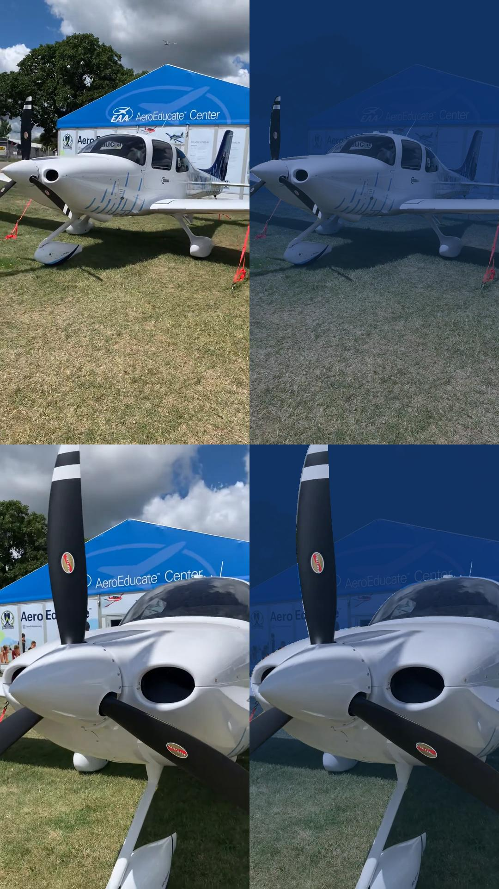

.. _results-label:

Results
=======

This section shows off some results that can be achieved with this repository. To get a sense of the capabilities and
limitations of the implemented approach, have a look at some of them!🔍

Renderings
**********

This are some results that show the reconstructed scene on the left and the clean scene on the right.

.. raw:: html

    <iframe width="560" height="315" src="https://www.youtube.com/embed/EjNc-o3LptY?si=wXmoviLHrwdfTHDc" title="YouTube video player" frameborder="0" allow="accelerometer; autoplay; clipboard-write; encrypted-media; gyroscope; picture-in-picture; web-share" allowfullscreen></iframe>

.. raw:: html

    

        
Click to see renderings of IUI3-RedSea

        <iframe width="560" height="315" src="https://www.youtube.com/embed/EjNc-o3LptY?si=wXmoviLHrwdfTHDc" title="YouTube video player" frameborder="0" allow="accelerometer; autoplay; clipboard-write; encrypted-media; gyroscope; picture-in-picture; web-share" allowfullscreen></iframe>
    

.. raw:: html

    

        
Click to see renderings of Curasao

        <video width="720" height="240" controls loop>
            <source src="../media/Curasao.mp4" type="video/mp4">
            Your browser does not support the video tag.
        </video>
    

.. raw:: html

    

        
Click to see renderings of JapaneseGradens-RedSea [sic]

        <video width="720" height="240" controls loop>
            <source src="../media/JapaneseGradens-RedSea.mp4" type="video/mp4">
            Your browser does not support the video tag.
        </video>
    

.. raw:: html

     

The implementation can also be used to render depthmaps and object weight accumulation maps of the scene. The following videos
show the depthmaps on the left and the object weight accumulation maps on the right. From the object accumulation maps, we
can nicely see, that the model is able to seperate between objects (red hue, indicating high accumulation) and the water (blue
hue, indicating low accumulation).

.. raw:: html

    

        
Click to see renderings of IUI3-RedSea

        <video width="720" height="240" controls loop>
            <source src="../media/IUI3-RedSea_maps.mp4" type="video/mp4">
            Your browser does not support the video tag.
        </video>
    

.. raw:: html

    

        
Click to see renderings of Curasao

        <video width="720" height="240" controls loop>
            <source src="../media/Curasao_maps.mp4" type="video/mp4">
            Your browser does not support the video tag.
        </video>
    

.. raw:: html

    

        
Click to see renderings of JapaneseGradens-RedSea [sic]

        <video width="720" height="240" controls loop>
            <source src="../media/JapaneseGradens-RedSea_maps.mp4" type="video/mp4">
            Your browser does not support the video tag.
        </video>
    

.. raw:: html

     

The model also allows to render only the backscatter of the scene and the clear scene but with attenuation effects.

Synthetic Water Effects
***********************

Some results of adding synthetic water to scenes are visualized below:

Machine hall dataset:

.. image:: media/machine_hall_synthetic.png
   :align: center

.. raw:: html

     

Windturbine dataset:

.. image:: media/Nordtank_synthetic.jpg
   :align: center

.. raw:: html

     

Dozer scene:

.. image:: media/dozer_synthetic.jpeg
   :align: center

.. raw:: html

     

Plane scene:

